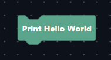
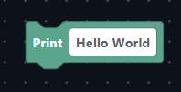

# Creating a block for Discodes

This is a comprehensive guide on how to create blocks for the Discodes codebase. This article will go through the basics on how to create blocks and also teach the basic rules and conventions of block creation.

## Where are blocks created?

Blocks are inside the `src/lib/blocks/` directory. Each folder represents a [parent]() category and each file represents a [child]() category.

A folder can contain one or more files/folders, but a folder cannot be empty. Multiple files in a folder will result in multiple categories inside of one.

> Note: <br>
> Parent categories do not contain any blocks and their name is defined by their folder name. <br>
> Child categories contain the categorie's properties inside the file such as its name or color.

### Todo : Show image example here

All the block's data are found inside each file's content, alongside with it's coresponding categorie's data.

### Structure of a block file :

```ts
// Logic.ts
// All the neccesary imports to make the block creation easier :

// Enums
import { BlockShape, BlockType } from "$lib/enums/BlockTypes";

// Definitions
import type { BlockDefinition } from "$lib/interfaces/BlockDefinition";
import type { CategoryDefinition } from "$lib/interfaces/CategoryDefinition";

// Inputs
import TextInput from "$lib/utils/BlockGen/Inputs/TextInput";

// Blockly
import { Order } from "blockly/javascript";

// This variable contains all the blocks in an array, each block is of type "BlockDefinition"
const blocks: BlockDefinition[] = [
	/* All the blocks in here */
];

// This variable contains the categorie's properties, it is of type "CategoryDefinition"
const category: CategortyDefinition = {
	/* Properties in here */
};

// We need to export both of the variables for the block generation and the category generation to pick them up and register them
export default { blocks, category };
```

> Note:
> The imports will change depending on your needs, you may not need all of those imports or you may need more!

## How to create a block

To create a block you must first know what a block is made of.
A block is made of three main properties:

- A text, to make it easier for the user to work with the block.
- Arguments, to add custom inputs to the block so the user can customize it.
- A code, used to define the value it's going to output in the exported code.

Without those three properties a block is pretty much unusable. Those properties have to be used and applied correctly for the block to be intuitive to use and debug.

### The full block definition interface :

```ts
// If the property has a question mark, it is optional.
type BlockDefinition = {
	// Serves as an identifier in the code, has to be unique
	id: string;
	// To check if the block is a label or not
	label?: boolean;
	// The text displayed on the block
	text: string;
	// What type of data the block outputs (eg: Boolean, String, etc.)
	output?: BlockType;
	// The block shape
	shape: BlockShape;
	// The block arguments, sorted in an array
	args?: Argument[];
	// The block's warnings
	warnings?: Warning[];
	// The input's placeholders
	placeholders?: Placeholder<unknown>[];
	inline: boolean;
	colour: string;
	// The text displayed when hovering the cursor over the block
	tooltip: string;
	// URL when opening the block's context menu and click "help"
	helpUrl: string;
	// The block's code, with all the arguments passed in the "args" param
	code: (args: Record<string, unknown>) => unknown;
	// The blocks mutator(the gear icon located at the left top corner in the block)
	mutator?: Mutator;
	// Hides the block from category, but still have it registered as a block.
	// Mostly used for mutator blocks that are inside the mutator menu
	hidden?: boolean;
	// List of library imports that block requires.
	imports?: `${string}@${string}`[];
};
```

So considering that most of the parameters are not required, here is the minimum configuration for a block :

```ts
type BlockDefinition = {
	id: string;
	text: string;
	shape: BlockShape;
	inline: boolean;
	colour: string;
	tooltip: string;
	helpUrl: string;
	code: (args: Record<string, unknown>) => unknown;
};
```

### Example usage:

```ts
const blocks: BlockDefinition[] = [
	{
		id: "print",
		text: "Print Hello World",
		shape: BlockShape.Action,
		inline: true,
		colour: "#5ba58c",
		tooltip: "This block prints Hello World.",
		helpUrl: "https://wiki.discodes.xyz/",
		code: (args) => {
			return `console.log("Hello World")`;
		}
	}
];
```

> Note: <br>
> By convention, the block id is written in [snake_case](https://en.wikipedia.org/wiki/Snake_case)<br>
> The return type should always be a STRING or a TUPLE, nothing else.

This is the generated block:



#### Congrats you created your first block!

## Understanding inputs

As we can see above, blocks are pretty easy to make, but our example is pretty useless. It only outputs a single string and cannot be changed. We now want to make the block output a string that the user gave and for that we will need to add an input to the block.

### Adding an input to the block definition

To add an input to the block definition there is 3 easy steps to follow. First modify the text to add the input field to it. Then add the input into the `args` property. Finaly create custom code for the block.

First, let's modify the text to acknowledge the existence of an input.
To do that you simply need to put between curly braces the name of your argument :

#### Before:

```ts
text: "Print Hello World";
```

#### After:

```ts
text: "Print {TEXT}";
```

This step is necessary as it helps the interpreter generate the correct block definition to create the block with it's inputs correctly, so this step is crutial.

> Note: <br>
> By convention, the arguments name are always capitalized, this makes code easier to read and maintain.

After changing the text, we need to add our input in the `args` array. To do that simply add the `args` property to the block definition like this :

```ts
{
	// All the other properties here
	args: [];
}
```

Since we want to add a string input, we will import and add the `TextInput` class to the `args`.

The `TextInput` class takes two arguments, the name (`name: string`) of the input and it's default value (`defaultValue: string`) . In the text, we set the input name as `TEXT` so we are going to put the same in the `TextInput` argument. We are also going to put `"Hello World"` as a default value

```ts
import TextInput from "$lib/utils/BlockGen/Inputs/TextInput";

const blocks: BlockDefinition[] = {
	// All the properties
	args: [new TextInput("TEXT", "Hello World")]
};
```

We now set all the neccesary properties for the block to generate correctly, but one step is left. We need to write the code.

The `args` argument to the function is an object containing all the arguments with their name as keys. In our case `args` is equal to:

```ts
args = {
    TEXT: // The input value
}
```

We can now write the code :

```ts
{
	// All the other properties here
	code: (args) => {
		return `console.log(${args.TEXT})`;
	};
}
```

And voila, you just made your first block with an input! Here is the result with the full code :

```ts
import type { BlockDefinition } from "$lib/interfaces/BlockDefinition";
import TextInput from "$lib/utils/BlockGen/Inputs/TextInput";

const blocks: BlockDefinition[] = [
	{
		id: "print",
		text: "Print {TEXT}",
		code: (args) => {
			return `console.log(${args.TEXT})`;
		},
		args: [new TextInput("TEXT", "Hello World")],
		shape: BlockShape.Action,
		inline: true,
		colour: "#5ba58c",
		tooltip: "This block prints Hello World.",
		helpUrl: "https://wiki.discodes.xyz/"
	}
];
```



### For a more complete guide on Inputs, visit the [Inputs](Inputs.md) page

## Using warnings
